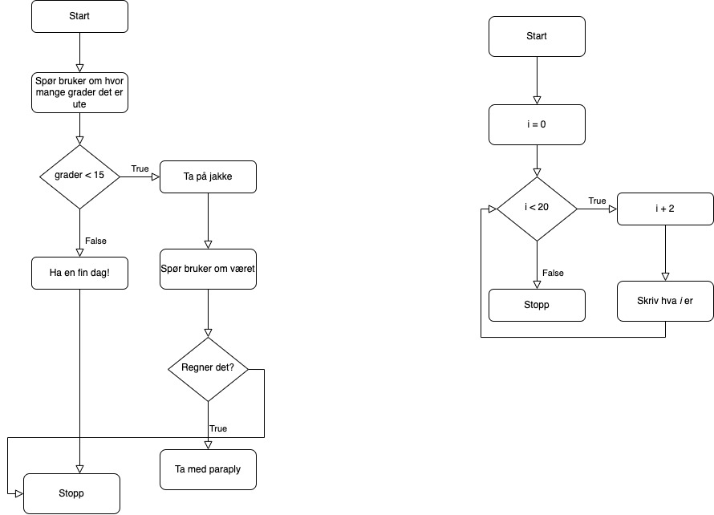

# Programflyt

Programflyt forteller hvordan løkker, if-setninger og generelt alt vi programmerer fungerer.

## Eksempler på flytdiagram

Eksempel med if-setning:
```python
grader = input("Hvor mange grader er det? ")
if grader < 15:
    print("Ta på jakke")
    vær = input("Regner det? ")
    if vær.lower() == "ja":
        print("Ta med paraply")
else:
    print("Ha en fin dag")
```

Eksempel med while-løkke:
```python
i = 0
while i < 20:
    i += 20
    print(i)
```

Her er bilde av flytdiagrammet til disse ti:
